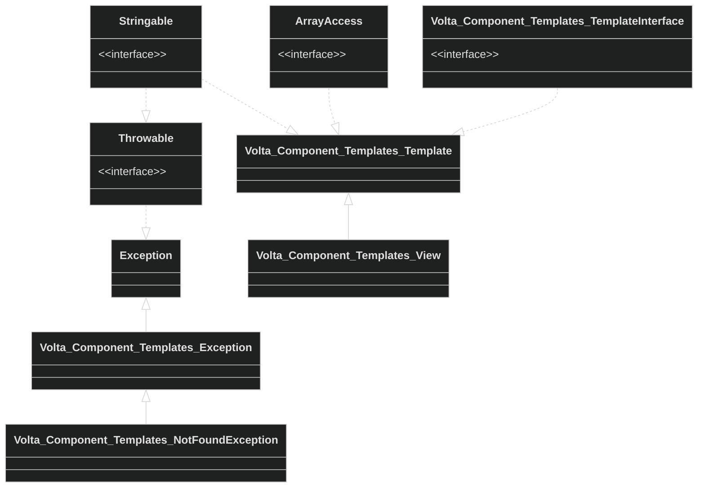

# Volta\Components\Templates

An HTML - PHP template module based on the PHP build in template engine.



## Usage

```php

use Volta\Component\Templates\Template as View

// Set the Base Directory globally
// Note: In Volta all directory references ends with a slash
View::setBaseDir('/path/to/templates/directory/');

// Create a view with basic placeholders
$view = new View('layout.html.php', [
    'title' => 'Unknown page'
]);

// add placeholders using the set function
$view->set('description', 'A simple home page')

// or use array access
$view['keywords'] = 'home, simple';

// add the template for the content and overwrite some off the parents
// placeholders
$view->addSubTemplate('content', 'content.html.php', ['title' => 'Contact'])

// render the view
echo $view;
```


`layout.html.php`
```php
<?php ?>
<!DOCTYPE html>
<html>
<head>
    <title><?= $this->get('title', 'No Title'); ?></title>
    <link rel="stylesheet" href="/assets/css/main.css">
</head>
<body>
    <h1><?= $this['title']; ?></h1>
    <?= $this->getSubTemplate('content'); ?>
</body>
</html>
```

`content.html.php`
```php
<?php ?>
<h2><?= $this['title']; ?></h2>
```

