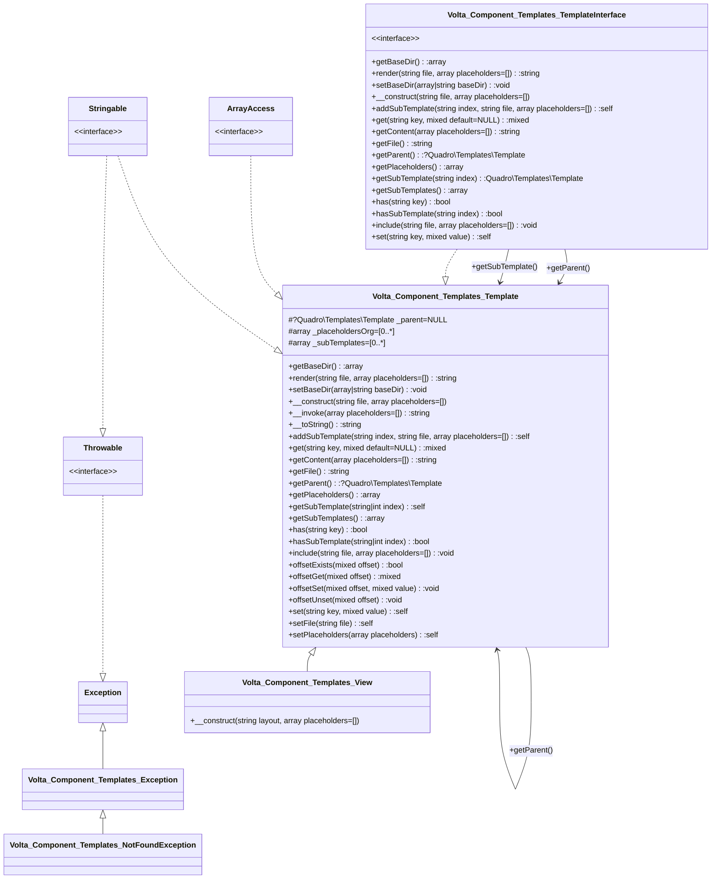

# Quadro Templates

A HTML - PHP template module based on the PHP build in template engine.

## Usage

```php

use Volta\Component\Templates\Template as View

// Set the Base Directory globally
// Note: In Quadro all directory references ends with a slash
View::setBaseDir('/path/to/templates/directory/');

// Create a view with basic placeholders
$view = new View('layout.phtml', [
    'title' => 'Unknown page'
]);

// add placeholders using the set function
$view->set('description', 'A simple home page')

// or use array access
$view['keywords'] = 'home, simple';

// add the template for the content and overwrite some off the parents
// placeholders
$view->addSubTemplate('content', 'content.phtml', ['title' => 'Contact'])

// render the view
echo $view;
```


`layout.phtml`
```php
<?php ?>
<!DOCTYPE html>
<html>
<head>
    <title><?= $this->get('title', 'No Title'); ?></title>
    <link rel="stylesheet" href="/assets/css/main.css">
</head>
<body>
    <h1><?= $this['title']; ?></h1>
    <?= $this->getSubTemplate('content'); ?>
</body>
</html>
```


`content.phtml`
```php
<?php ?>
<h2><?= $this['title']; ?></h2>
```

[//]: # (Start Quadro\UmlDoc\MermaidDiagram)

[//]: # (End Quadro\UmlDoc\MermaidDiagram)
[//]: # (Start Quadro\UmlDoc\MdDiagram)

Generated @  20230619 13:50:50

# Quadro\Templates\
4 Classes, 1 Interfaces, 0 Traits, 0 Enums,
### [Quadro\Templates\Exception](#) : Exception *implements* Throwable, Stringable
 The base Exception class for the Quadro\Db namespace
### [Quadro\Templates\NotFoundException](#) : Quadro\Templates\Exception *implements* Stringable, Throwable
### [Quadro\Templates\Template](#) *implements* Quadro\Templates\TemplateInterface, ArrayAccess, Stringable
 Includes a PHP template file but in a local scope.
#### Properties(3)
- protected ?Quadro\Templates\Template **[_parent](#)** = NULL
- protected array **[_placeholdersOrg](#)** = [0..*]
- protected array **[_subTemplates](#)** = [0..*]
#### Methods(25)
- public static function **[getBaseDir](#)()**: array
- public static function **[render](#)(string file, array placeholders=[])**: string\
&rdsh; *Creates a new template and returns rendered content*
- public static function **[setBaseDir](#)(array|string baseDir)**: void\
&rdsh; *Sets the directory the templates are loaded from*
- public function **[__construct](#)(string file, array placeholders=[])**:
- public function **[__invoke](#)(array placeholders=[])**: string\
&rdsh; *NOTE: The passed placeholders will be merged with the ones passed at construction and overwrites*\
&nbsp;&nbsp; *existing placeholders*
- public function **[__toString](#)()**: string
- public function **[addSubTemplate](#)(string index, string file, array placeholders=[])**: self
- public function **[get](#)(string key, mixed default=NULL)**: mixed\
&rdsh; *Checks if there is a placeholder with the name __$key__ and returns it*\
&nbsp;&nbsp; *if not checks the default value __$default__ provided to be returned.*\
&nbsp;&nbsp; *if no default value return 'NO VALUE FOR  "' .$key . '"'*
- public function **[getContent](#)(array placeholders=[])**: string\
&rdsh; *Renders the template, substitutes the __$placeholders__ and returns the result*\
&nbsp;&nbsp; \
&nbsp;&nbsp; *NOTE: The passed placeholders will be merged with the ones passed at construction and overwrites*\
&nbsp;&nbsp; *existing placeholders. If we have a parent placeholders will also be extracted but overwritten by*\
&nbsp;&nbsp; *the current placeholders list*
- public function **[getFile](#)()**: string
- public function **[getParent](#)()**: ?Quadro\Templates\Template\
&rdsh; *Getter*\
&nbsp;&nbsp; \
&nbsp;&nbsp; *Will be set when this template is included through the*\
&nbsp;&nbsp; *Template::include() method. Defaults to null*
- public function **[getPlaceholders](#)()**: array
- public function **[getSubTemplate](#)(string|int index)**: self
- public function **[getSubTemplates](#)()**: array\
&rdsh; *Getter*\
&nbsp;&nbsp; \
&nbsp;&nbsp; *Will be filled when templates are included through the*\
&nbsp;&nbsp; *Template::include() method.*
- public function **[has](#)(string key)**: bool
- public function **[hasSubTemplate](#)(string|int index)**: bool
- public function **[include](#)(string file, array placeholders=[])**: void\
&rdsh; *Includes a independent templateal*
- public function **[offsetExists](#)(mixed offset)**: bool
- public function **[offsetGet](#)(mixed offset)**: mixed
- public function **[offsetSet](#)(mixed offset, mixed value)**: void
- public function **[offsetUnset](#)(mixed offset)**: void
- public function **[set](#)(string key, mixed value)**: self
- public function **[setFile](#)(string file)**: self
- public function **[setPlaceholders](#)(array placeholders)**: self
### [Quadro\Templates\View](#) : Quadro\Templates\Template *implements* Stringable, ArrayAccess, Quadro\Templates\TemplateInterface
 Combines a layout and content templates
#### Methods(1)
- public function **[__construct](#)(string layout, array placeholders=[])**:
### [Quadro\Templates\TemplateInterface](#)
#### Methods(16)
- abstract public static function **[getBaseDir](#)()**: array
- abstract public static function **[render](#)(string file, array placeholders=[])**: string\
&rdsh; *Renders the __$file__, substitutes the __$placeholders__ and returns the result*
- abstract public static function **[setBaseDir](#)(array|string baseDir)**: void\
&rdsh; *Sets the directory the templates are loaded from*
- abstract public function **[__construct](#)(string file, array placeholders=[])**:
- abstract public function **[addSubTemplate](#)(string index, string file, array placeholders=[])**: self
- abstract public function **[get](#)(string key, mixed default=NULL)**: mixed\
&rdsh; *Checks if there is a placeholder with the name __$key__ and returns it*\
&nbsp;&nbsp; *if not checks the default value __$default__ provided to be returned.*\
&nbsp;&nbsp; *if no default value return 'NO VALUE FOR  "' .$key . '"'*
- abstract public function **[getContent](#)(array placeholders=[])**: string\
&rdsh; *Renders the template, substitutes the __$placeholders__ and returns the result*\
&nbsp;&nbsp; \
&nbsp;&nbsp; *NOTE: The passed placeholders will be merged with the ones passed at construction and overwrites*\
&nbsp;&nbsp; *existing placeholders. The parent placeholders, if any, will also be extracted but overwritten by*\
&nbsp;&nbsp; *the current placeholders list*
- abstract public function **[getFile](#)()**: string
- abstract public function **[getParent](#)()**: ?Quadro\Templates\Template
- abstract public function **[getPlaceholders](#)()**: array
- abstract public function **[getSubTemplate](#)(string index)**: Quadro\Templates\Template
- abstract public function **[getSubTemplates](#)()**: array
- abstract public function **[has](#)(string key)**: bool
- abstract public function **[hasSubTemplate](#)(string index)**: bool
- abstract public function **[include](#)(string file, array placeholders=[])**: void\
&rdsh; *Includes a independent template*
- abstract public function **[set](#)(string key, mixed value)**: self

[//]: # (End Quadro\UmlDoc\MdDiagram)
